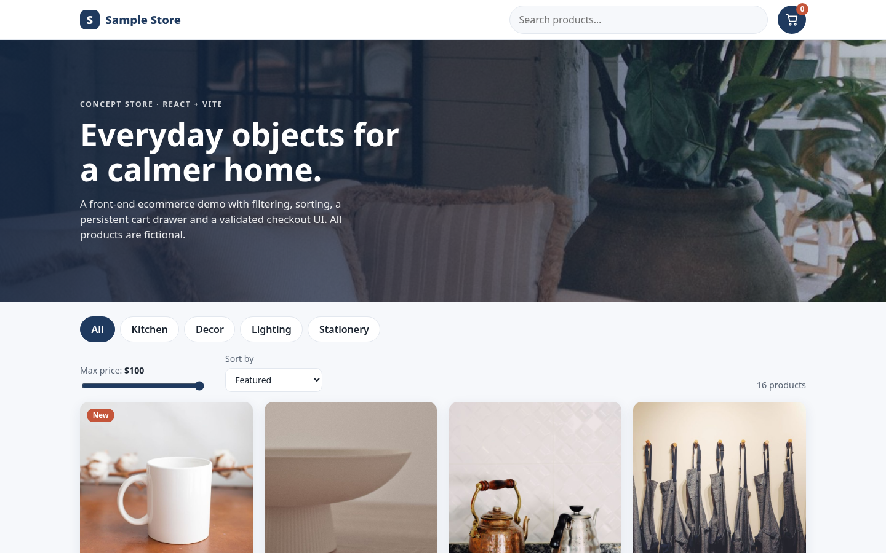
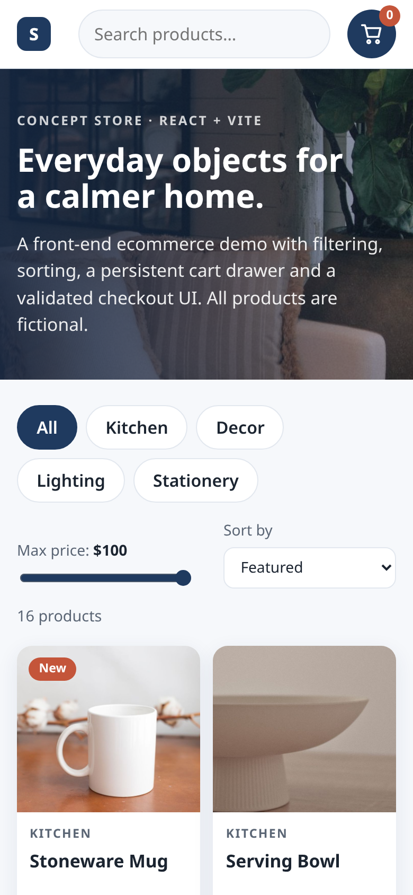

# Sample Store – React Ecommerce Front-End (Concept)

> **Concept / sample project.** A self-made demo for portfolio purposes. "Sample Store" is a fictional shop – it is **not client work**. Products and prices are invented, product photos are royalty-free stock images used as placeholders (not photos of real products for sale), and the checkout is UI only: no payments are processed and no data is sent anywhere.

## What it is
A front-end ecommerce storefront showing the typical shopping flow: browse → filter → add to cart → review cart → checkout form → confirmation.

## Tech
- **React 18** + **Vite 5** (ES modules, hooks only)
- Plain CSS (custom properties, Grid, Flexbox, responsive breakpoints)
- Royalty-free product/hero photos stored locally in `public/images/` (no hot-linking); the original SVG illustrations remain as a graceful fallback if an image fails to load; no external fonts or APIs

## Features
- Product grid with 16 fictional products across 4 categories
- Category chips, live search, max-price slider and sorting
- Cart drawer with quantity controls, remove, subtotal; persisted in `localStorage`
- Checkout UI: contact, shipping method, demo payment fields, inline validation, order summary with demo shipping/tax, confirmation screen
- Accessibility: skip link, ARIA labels, `aria-live` updates, Escape to close, visible focus styles
- Responsive from small phones to wide desktops

## Run it
```bash
npm install
npm run dev      # development
npm run build    # production build into dist/
npm run preview  # serve the build
```

## Project structure
```
src/
  App.jsx               state: cart, filters, sorting
  data/products.js      fictional catalogue
  components/           Header, Filters, ProductCard, ProductImage (photo + SVG fallback), ProductArt (SVG), CartDrawer, Checkout
  styles.css
public/images/          local photos (products/p1..p16.jpg, hero-banner.jpg)
```

## Screenshots
| Desktop | Mobile |
|---|---|
|  |  |

## Photo credits
Stock photos are from [Pexels](https://www.pexels.com) and used under the [Pexels License](https://www.pexels.com/license/) (free for commercial use, no attribution required – credited here anyway). Photos are the closest generic match for each fictional product; they are not photos of real items for sale. Files live in `public/images/`.

| File (`public/images/`) | Used for | Photo | Photographer |
|---|---|---|---|
| `products/p1.jpg` | Stoneware Mug | https://www.pexels.com/photo/still-life-with-mug-6312262/ | Katrin Bolovtsova |
| `products/p2.jpg` | Serving Bowl | https://www.pexels.com/photo/ceramic-bowl-on-a-wooden-surface-14380628/ | Qwirki & Co. |
| `products/p3.jpg` | Tea Kettle | https://www.pexels.com/photo/stainless-kettles-on-the-gas-stove-12974474/ | H. Hümâ Yardim |
| `products/p4.jpg` | Linen Apron | https://www.pexels.com/photo/aprons-hanging-on-the-wall-10689795/ | Alyssa DeGarde |
| `products/p5.jpg` | Ceramic Vase | https://www.pexels.com/photo/close-up-shot-of-ceramic-vase-with-dried-flowers-7000100/ | cottonbro studio |
| `products/p6.jpg` | Potted Fern | https://www.pexels.com/photo/elegant-potted-maidenhair-fern-in-modern-decor-29024997/ | Dmitry Alexandrovich |
| `products/p7.jpg` | Round Wall Clock | https://www.pexels.com/photo/minimalist-wall-clock-with-roman-numerals-37652540/ | Kimy Moto |
| `products/p8.jpg` | Woven Throw | https://www.pexels.com/photo/close-up-photo-of-a-striped-blanket-7225354/ | Alexandra Titova |
| `products/p9.jpg` | Arc Desk Lamp | https://www.pexels.com/photo/vignette-image-of-a-lamp-on-a-desk-19240055/ | Juliane Monari |
| `products/p10.jpg` | Glass Pendant | https://www.pexels.com/photo/hanging-clear-glass-pendant-lamps-12202390/ | Samuel Peter |
| `products/p11.jpg` | Soy-style Candle | https://www.pexels.com/photo/scented-candle-in-a-glass-jar-12349435/ | Towfiqu barbhuiya |
| `products/p12.jpg` | Paper Lantern | https://www.pexels.com/photo/a-hanging-chinese-paper-lantern-6936761/ | H&CO |
| `products/p13.jpg` | Dotted Notebook | https://www.pexels.com/photo/opened-notebook-with-pen-on-white-desk-5797900/ | Ann poan |
| `products/p14.jpg` | Desk Organiser | https://www.pexels.com/photo/shelf-at-the-desk-with-computer-accessories-19304050/ | Minh Phuc |
| `products/p15.jpg` | Gel Pen Set | https://www.pexels.com/photo/a-set-of-writing-materials-in-different-shades-of-purple-and-blue-7123021/ | Tara Winstead |
| `products/p16.jpg` | Canvas Tote | https://www.pexels.com/photo/white-canvas-tote-bags-on-wooden-shelf-9787521/ | Nati |
| `hero-banner.jpg` | Hero banner | https://www.pexels.com/photo/cozy-living-room-with-vintage-decor-and-plants-30937879/ | Sami Abdullah |

## Honest note
This is a sample built to demonstrate my React / ecommerce front-end skills. A real store would add a backend or a platform such as Shopify for catalogue, payments and orders. The demo includes no real brands, reviews, testimonials or sales figures.
